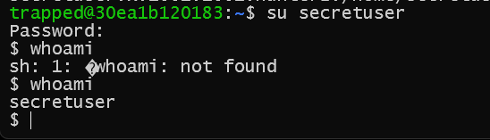

# Trapped_in_Plain_Sight_2

- Chạy lệnh `ssh -p 4302 trapped@challenge.utctf.live` kết nối được tới server với user `trapped`.
- Tìm file có chứa flag. Tìm được `flag.txt` nằm ở thư mục `/home/trapped`. Tuy nhiên, quyền tương tác với file này bị hạn chế rất nhiều bởi user root.

- Kiểm tra danh sách kiểm soát truy cập của file `flag.txt` thấy người dùng secretuser được phép đọc file này

- Cat file `etc/passwd` thấy ngoài user hiện tại là `trapped` còn có user `secretuser`, đồng thời thấy trường `GECOS` có dòng chữ `hunter2`, có thể đoán đây là password để đăng nhập với user `secretuser`.

- Thử đăng nhập với user `secretuser` thì đăng nhập thành công

- Sau đó cat thử file `flag.txt` có chứa trong thư mục `/home/trapped` thì lấy được flag.

> **Flag:** utflag{4ccess_unc0ntroll3d}